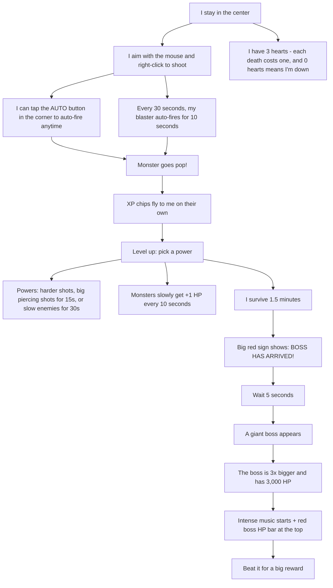

# Game diagrams

These pictures show what happens in the game, in plain words.

## Survive, level up, and fight the boss

```mermaid
flowchart TD
  A[I stay in the center] --> B[I aim with the mouse and right-click to shoot]
  A --> A2[I have 3 hearts - each death costs one, and 0 hearts means I'm down]
  B --> C[I can tap the AUTO button in the corner to auto-fire anytime]
  B --> D[Every 30 seconds, my blaster auto-fires for 10 seconds]
  C --> E[Monster goes pop!]
  D --> E[Monster goes pop!]
  E --> F[XP chips fly to me on their own]
  F --> I[Level up: pick a power]

  I --> J[Powers: harder shots, big piercing shots for 15s, or slow enemies for 30s]
  I --> K[Monsters slowly get +1 HP every 10 seconds]
  I --> L[I survive 1.5 minutes]
  L --> M[Big red sign shows: BOSS HAS ARRIVED!]
  M --> N[Wait 5 seconds]
  N --> O[A giant boss appears]
  O --> P[The boss is 3x bigger and has 3,000 HP]
  P --> Q[Intense music starts + red boss HP bar at the top]
  Q --> R[Beat it for a big reward]
```
